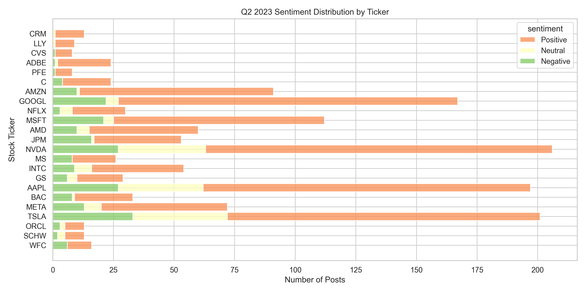
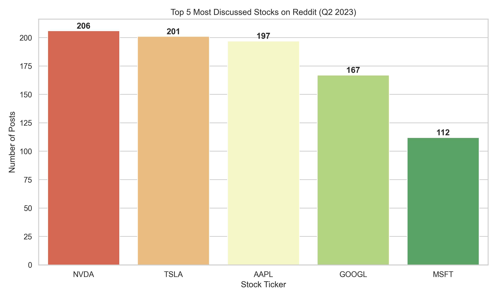
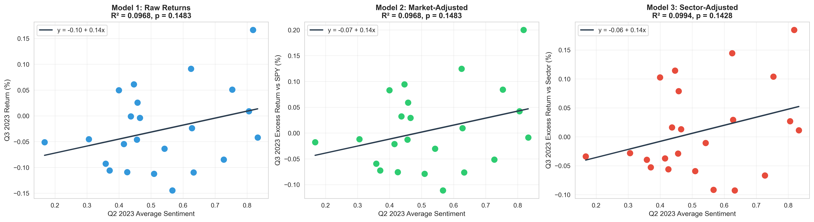
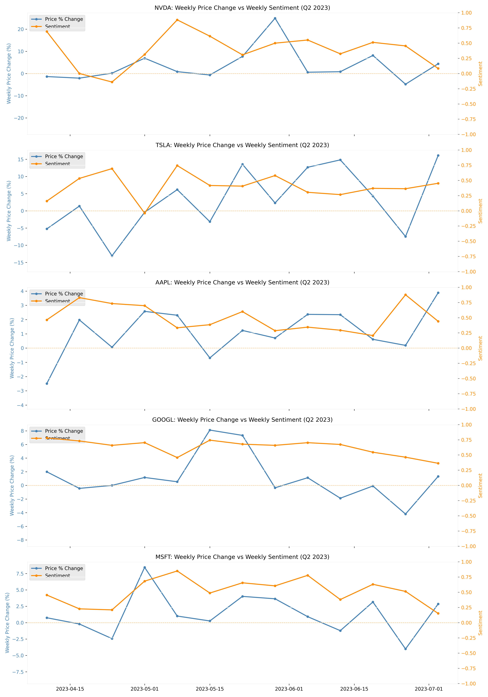
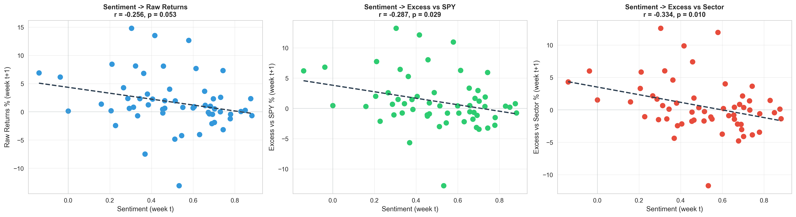
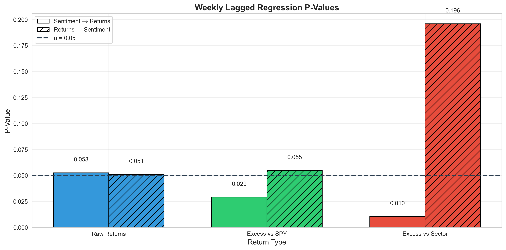

# Reddit Sentiment and Stock Performance: A Predictive Analysis

**Authors:** Eshan Prakash, Eduardo Rebollar, and Aaron Good

## Introduction

### Background

Online social media discussion platforms like Reddit have become influential spaces where investors share information and coordinate trading activity. The 2021 GameStop surge demonstrated how subreddits like r/WallStreetBets can drive extreme market volatility, raising questions about whether social media sentiment merely reflects investor mood or actually predicts and influences price movements.

While prior studies have shown correlations between social media sentiment and short-term market activity, the strength, consistency, and predictive power of Reddit sentiment across different stocks and time horizons remains unclear. Understanding this relationship has broad implications for investors, researchers, and policymakers as financial discourse increasingly occurs online.

### Statement of Significance

This research investigates whether Reddit user sentiment about publicly traded stocks can predict subsequent stock price movements at both quarterly and weekly time scales. We find evidence that weekly sentiment acts as a contrarian indicator—high short-term optimism predicts weaker returns the following week. However, quarterly aggregated sentiment shows no significant predictive power.

These findings advance our understanding of how online investor sentiment relates to market movements and have practical implications for both investors and researchers studying social media's role in financial markets.

---

## Research Question

Does Reddit user sentiment about publicly traded stocks predict subsequent stock price movements?

We examine this question at two time scales:

1. Quarterly Analysis: Does sentiment expressed in Reddit discussions during Q2 2023 (April–June) correlate with stock performance in Q3 2023 (July–September)?

2. Weekly Analysis: For the top 5 most-discussed stocks, does weekly sentiment predict next week's returns (or vice versa)?

We hypothesize that higher average sentiment will correspond with increased stock returns, suggesting that Reddit sentiment functions as a positive predictor of stock price changes rather than merely reflecting concurrent market trends.

---

## Data Collection

### Data Sources

Reddit Data:
- API: Pullpush.io API (archival Reddit data)
- Subreddits: r/WallStreetBets (speculative trading), r/stocks (general analysis), r/StockMarket (macro commentary)
- Time Period: April 1 – June 30, 2023 (Q2 2023)
- Total Posts Collected: Filtered based on engagement thresholds

Stock Data:
- Source: Yahoo Finance (yfinance Python library)
- Time Period: April 1 – September 30, 2023 (Q2-Q3 2023)
- Benchmarks: S&P 500 (SPY) and sector-specific ETFs (XLK, XLF, XLV, XLE, ITA)

### Stock Selection

We analyzed 50 stocks across 5 sectors:
- Technology (15 stocks): AAPL, MSFT, GOOGL, AMZN, META, NVDA, TSLA, AMD, NFLX, INTC, CRM, ORCL, ADBE, CSCO, UBER
- Finance (10 stocks): JPM, BAC, WFC, GS, MS, C, V, MA, AXP, SCHW
- Healthcare (10 stocks): JNJ, UNH, PFE, ABBV, LLY, MRK, TMO, CVS, AMGN, BMY
- Energy (10 stocks): XOM, CVX, COP, SLB, EOG, OXY, MPC, PSX, VLO, HAL
- Aerospace/Defense (5 stocks): LMT, RTX, BA, NOC, GD

### Filtering Criteria

To ensure data quality, posts were included only if they:
1. Originated from one of the three target subreddits
2. Explicitly mentioned stock tickers or company names
3. Exceeded the subreddit's median upvote or comment count
4. Were written in English
5. Fell within the April 1–June 30, 2023 timeframe

Median Engagement Thresholds by Subreddit:
- r/WallStreetBets: 27 upvotes OR 21 comments
- r/stocks: 11 upvotes OR 25 comments
- r/StockMarket: 20 upvotes OR 15 comments

After applying these filters and requiring stocks to have at least the median number of mentions across all stocks, 23 stocks met the threshold for the quarterly analysis.

---

## Methodology

### Sentiment Analysis

We used VADER (Valence Aware Dictionary and sEntiment Reasoner), a lexicon-based sentiment analysis tool specifically designed for social media text. VADER produces a compound sentiment score ranging from -1 (most negative) to +1 (most positive).

Process:
1. Combined post title and body text for each Reddit post
2. Computed VADER compound sentiment score for each post
3. Aggregated sentiment scores by stock ticker across Q2 2023
4. Calculated mean sentiment score per ticker as the independent variable

Sentiment Classification:
- Positive: compound score ≥ 0.05
- Neutral: -0.05 < compound score < 0.05
- Negative: compound score ≤ -0.05

### Stock Return Calculation

For each stock, we calculated three measures of performance:

1. Raw Return: `(End_Price - Start_Price) / Start_Price`
2. Market-Adjusted Return: `Raw_Return - SPY_Return` (controls for overall market movement)
3. Sector-Adjusted Return: `Raw_Return - Sector_ETF_Return` (controls for sector-specific trends)

### Statistical Analysis

#### Part 1: Quarterly Cross-Sectional Analysis

We tested three regression models with increasing levels of control:

Model 1 (Raw Returns):
- Dependent Variable: Q3 raw stock return
- Independent Variable: Q2 average sentiment
- Tests whether sentiment predicts absolute price movement

Model 2 (Market-Adjusted Returns):
- Dependent Variable: Q3 excess return vs. SPY
- Independent Variable: Q2 average sentiment
- Controls for overall market trends

Model 3 (Sector-Adjusted Returns):
- Dependent Variable: Q3 excess return vs. sector benchmark
- Independent Variable: Q2 average sentiment
- Controls for both market and sector-specific trends

#### Part 2: Weekly Time Series Analysis

For the top 5 most-discussed stocks (NVDA, TSLA, AAPL, GOOGL, MSFT), we conducted weekly lagged regression analysis:

Direction 1—Sentiment(t) → Returns(t+1):
- Does this week's sentiment predict next week's returns?

Direction 2—Returns(t) → Sentiment(t+1):
- Do this week's returns predict next week's sentiment?

This analysis uses pooled data across the 5 tickers (~60 observations) with simple OLS regression and standard t-tests.

For all analyses, we computed:
- Pearson correlation coefficient (measures linear relationship)
- Spearman rank correlation (non-parametric alternative)
- Linear regression (R², coefficient, p-value, standard error)

Statistical significance threshold: α = 0.05

---

## Results

### Sentiment Overview

<p align="center">
  
  <br><em>Distribution of positive, neutral, and negative posts across the top discussed stocks</em>
</p>

<p align="center">
  
  <br><em>The five most discussed stocks on Reddit during Q2 2023</em>
</p>

### Part 1: Quarterly Cross-Sectional Analysis

#### Descriptive Statistics

Final Dataset:
- Number of stocks analyzed: 23
- Q2 2023 average sentiment range: 0.168 to 0.833
- Q3 2023 raw return range: -11.2% to 9.1%
- SPY (S&P 500) Q3 return: -3.3%

#### Correlation Analysis Summary

| Model | Pearson r | p-value | R² | Variance Explained |
|-------|-----------|---------|----|--------------------|
| Model 1: Raw Returns | 0.3112 | 0.1483 | 0.0968 | 9.68% |
| Model 2: vs SPY | 0.3112 | 0.1483 | 0.0968 | 9.68% |
| Model 3: vs Sector | 0.3153 | 0.1428 | 0.0994 | 9.94% |

<p align="center">
  
  <br><em>Quarterly regression analysis across all three models showing weak positive but non-significant relationships</em>
</p>

#### Key Findings (Quarterly)

1. No statistically significant relationship was found between Q2 Reddit sentiment and Q3 stock returns in any of the three models (all p > 0.05).

2. A weak positive correlation exists across all models (r ≈ 0.31), but this could be due to random chance given the p-values.

3. Reddit sentiment explains only ~10% of the variance in Q3 stock returns.

4. The lack of significance holds whether measuring raw returns, market-adjusted returns, or sector-adjusted returns.

### Part 2: Weekly Time Series Analysis

For the top 5 most-discussed stocks (NVDA, TSLA, AAPL, GOOGL, MSFT) measured by total post count, we analyzed weekly sentiment and price movements:

<p align="center">
  
  <br><em>Weekly price changes vs sentiment for top 5 discussed stocks</em>
</p>

#### Sentiment(t) → Returns(t+1)

| Return Type | Pearson r | p-value | Significant? |
|-------------|-----------|---------|--------------|
| Raw Returns | -0.256 | 0.053 | No |
| Excess vs SPY | -0.287 | 0.029 | Yes |
| Excess vs Sector | -0.334 | 0.010 | Yes |

#### Returns(t) → Sentiment(t+1)

| Return Type | Pearson r | p-value | Significant? |
|-------------|-----------|---------|--------------|
| Raw Returns | +0.258 | 0.051 | No |
| Excess vs SPY | +0.254 | 0.055 | No |
| Excess vs Sector | +0.172 | 0.196 | No |

<p align="center">
  
  <br><em>Lagged regression: This week's sentiment predicting next week's returns (significant negative relationship)</em>
</p>

<p align="center">
  
  <br><em>P-value comparison showing significant results for Sentiment→Returns (2/3 models below α=0.05) vs non-significant Returns→Sentiment</em>
</p>

#### Key Findings (Weekly)

1. Weekly sentiment predicts next week's returns in the opposite direction (negative correlation, p < 0.05 for market-adjusted and sector-adjusted returns).
2. Weekly returns do not significantly predict next week's sentiment, though there is a weak positive trend (p > 0.05).
3. The negative predictive relationship is strongest for sector-adjusted returns (r = -0.334, p = 0.010).

### Sector Analysis

We examined whether the sentiment-return relationship differed by sector (Tech, Finance, Other):

- Tech stocks displayed a slightly stronger positive trend, though still weak and not statistically significant.
- Finance stocks showed almost no discernible pattern.
- Other sectors exhibited highly dispersed behavior with no visible structure.

Sector-specific regression lines confirm that no industry group shows a significant relationship.

---

## Discussion

### Interpretation of Results

Our analysis reveals a nuanced picture of the relationship between Reddit sentiment and stock performance.

Weekly Analysis (Significant Finding):
- Short-term sentiment spikes on Reddit act as a contrarian indicator: high weekly sentiment is followed by weaker returns the next week (significant negative correlation, p < 0.05 for market-adjusted and sector-adjusted returns).
- This suggests Reddit users may exhibit overreaction or excessive optimism at the weekly level.
- Short-term price movements show a weak (non-significant) positive relationship with next week's sentiment, suggesting returns may slightly influence subsequent discussion tone.

Quarterly Analysis (Non-Significant Finding):
- Longer-term aggregated sentiment shows a mild but statistically insignificant positive relationship with next-quarter returns (r ≈ 0.31, p > 0.14).
- While not significant, the direction is opposite to the weekly finding.

### Reconciling the Findings

The contrasting directions between weekly (negative) and quarterly (positive) relationships suggest:

1. Weekly sentiment is noisy and prone to overreaction—extreme short-term optimism tends to be followed by mean reversion.
2. Quarterly aggregated sentiment may reflect underlying fundamentals—sustained positive discussion about a company over months may capture genuine investor interest or improving fundamentals.
3. Time horizon matters—the same sentiment signal can have opposite implications depending on the analysis window.

### Implications for Investors

Reddit sentiment may function as a short-term contrarian indicator but not a reliable quarterly predictor.

Practical applications:
- Contrarian trading: Extremely positive weekly sentiment may signal near-term weakness.
- Avoid chasing hype: Stocks with sudden sentiment spikes may underperform in the following week.
- Long-term perspective: Quarterly sentiment trends are not reliable predictors, but the positive direction hints that sustained interest may matter.
- Risk management: Use sentiment extremes as warning signals rather than buy/sell triggers.

---

## Visualizations

### Sentiment Visualizations
- `sentiment_by_ticker.png` - Bar chart of Q2 sentiment scores by ticker
- `sentiment_vs_volume.png` - Scatter plot of sentiment vs discussion volume
- `sentiment_distribution.png` - Stacked bar chart of positive/neutral/negative posts
- `top_5_discussed.png` - Top 5 most discussed stocks on Reddit
- `sentiment_heatmap.png` - Heatmap of sentiment metrics

### Hypothesis Testing Visualizations
- `hypothesis_outlier_removed/three_models_comparison.png` - Side-by-side regression plots for all three models (outliers removed)
- `hypothesis_outlier_removed/sector_highlight_scatter.png` - Sector-highlighted scatterplot (outliers removed)
- `hypothesis_outlier_removed/sector_trendlines.png` - Sector-specific regression lines (outliers removed)

### Time Series Visualizations
- `top_5_price_sentiment_overlay.png` - Weekly price change vs sentiment (dual-axis)
- `top_5_excess_spy_sentiment_overlay.png` - Excess return vs SPY + sentiment
- `top_5_excess_sector_sentiment_overlay.png` - Excess return vs sector + sentiment
- `time_series_outlier_removed/weekly_sentiment_to_returns.png` - Lagged regression: sentiment → returns (outliers removed)
- `time_series_outlier_removed/weekly_returns_to_sentiment.png` - Lagged regression: returns → sentiment (outliers removed)

### Diagnostic Visualizations
- `model_outlier_removed/residual_plots.png` - Regression residual diagnostics (outliers removed)
- `model_outlier_removed/r_squared_comparison.png` - Model explanatory power comparison (outliers removed)
- `model_outlier_removed/correlation_comparison.png` - Pearson vs Spearman correlations (outliers removed)
- `time_series_outlier_removed/weekly_pvalue_comparison.png` - Weekly lagged regression p-values (outliers removed)

### Robustness Check Visualizations
- `comparison/distribution_comparison.png` - VADER vs RoBERTa sentiment distributions

---

## Robustness Checks

### Sentiment Model Validation

We compared VADER scores with a financial-domain RoBERTa model (soleimanian/financial-roberta-large-sentiment) to assess sensitivity to sentiment analysis method choice.

**Results**: VADER and RoBERTa show weak agreement (Pearson r = 0.24, label agreement = 42.5%), indicating sentiment methodology significantly affects measurements. This suggests our findings may be specific to VADER's approach.

### Outlier Sensitivity Analysis

We re-ran all OLS regressions after removing outliers using the z-score method (threshold = 3.0) to test whether extreme observations drive results.

**Results**:
- Quarterly analysis: Removed 0 observations (no outliers detected). Results remain unchanged.
- Weekly analysis: Removed 2 observations from 60 total (3.3%). Main findings persist—weekly sentiment still significantly predicts returns for market-adjusted (p = 0.029) and sector-adjusted (p = 0.010) returns, though raw returns became marginally non-significant (p = 0.053).

The core conclusions are robust to outlier removal. All reported results use outlier-removed data.

Scripts: `statistical_analysis_outlier_removed.py`, `time_series_analysis_outlier_removed.py`

---

## Limitations

1. Sample Size: Only 23 stocks met quarterly analysis criteria; weekly analysis limited to top 5 tickers.
2. Time Period: Single quarter (Q2-Q3 2023) may not be representative.
3. Sentiment Analysis: VADER and RoBERTa produce substantially different sentiment scores (r = 0.24, label agreement = 42.5%), indicating results are sensitive to sentiment model choice and may not generalize across methods.
4. Lag Structure: Optimal lag unknown; effects may exist at different time scales.
5. Confounding Variables: Does not control for earnings, news events, or institutional activity.
6. Selection Bias: Focus on high-engagement posts and large-cap stocks.
7. Causality: Observational design cannot establish causal relationships.

---

## Conclusion

This study investigated whether Reddit user sentiment predicts stock performance using both quarterly cross-sectional analysis (23 stocks) and weekly time series analysis (top 5 most-discussed stocks).

Key findings:

1. Weekly sentiment significantly predicts next week's returns—negatively (r ≈ -0.26 to -0.33, p < 0.05 for market-adjusted and sector-adjusted returns). High weekly sentiment is followed by weaker returns, suggesting Reddit optimism acts as a contrarian indicator.

2. Weekly returns do not significantly predict next week's sentiment (r ≈ +0.17 to +0.26, p > 0.05). The positive direction suggests price movements may weakly influence subsequent discussion tone.

3. Quarterly sentiment shows a non-significant positive relationship with next-quarter returns (r ≈ 0.31, p > 0.14). The opposite direction from weekly findings suggests aggregated sentiment may capture different information.

4. Time horizon matters: The same sentiment data produces opposite correlations at different time scales.

Interpretation:

Short-term sentiment spikes on Reddit tend to be contrarian—high weekly sentiment is followed by weaker returns the next week. However, longer-term aggregated sentiment (quarterly) shows a mild but statistically insignificant positive relationship with next-quarter returns. This suggests that while weekly Reddit sentiment is noisy and prone to overreaction, broader sustained sentiment about a company may reflect underlying investor interest or fundamentals.

Implications:
- Reddit sentiment may serve as a short-term contrarian indicator for the top discussed stocks.
- Investors should be cautious about chasing stocks with sudden sentiment spikes.
- Quarterly sentiment is not a reliable standalone predictor.
- Future research should explore optimal time horizons and expand to smaller-cap stocks where retail influence may be stronger.

---

## Repository Structure

```
reddit-stock-sentiment/
│
├── data/
│   ├── reddit_posts_q2_2023_full.json                 # Raw Reddit posts
│   ├── reddit_posts_q2_2023_filtered.json             # Filtered posts
│   ├── reddit_posts_q2_2023_with_sentiment.json       # Posts with VADER scores
│   ├── q2_2023_sentiment_by_ticker.json/.csv          # Aggregated Q2 sentiment
│   ├── q3_2023_with_benchmarks.json/.csv              # Q3 stock returns with benchmarks
│   ├── top5_price_history_q2_q3_2023.csv              # Price history for top 5 tickers
│   ├── merged_sentiment_returns_outlier_removed.csv   # Merged dataset (outliers removed)
│   ├── regression_summary_outlier_removed.csv         # Quarterly regression results (outliers removed)
│   ├── weekly_panel_top5_outlier_removed.csv          # Weekly panel data (outliers removed)
│   ├── weekly_lagged_regression_results_outlier_removed.csv  # Weekly regression results (outliers removed)
│   └── vader_roberta_comparison.csv                   # VADER vs RoBERTa comparison
│
├── images/
│   ├── figures/
│   │   ├── sentiment/
│   │   │   ├── sentiment_by_ticker.png
│   │   │   ├── sentiment_vs_volume.png
│   │   │   ├── sentiment_distribution.png
│   │   │   ├── sentiment_heatmap.png
│   │   │   └── top_5_discussed.png
│   │   ├── hypothesis_outlier_removed/
│   │   │   ├── three_models_comparison.png
│   │   │   ├── sector_highlight_scatter.png
│   │   │   └── sector_trendlines.png
│   │   ├── time_series/
│   │   │   ├── top_5_price_sentiment_overlay.png
│   │   │   ├── top_5_excess_spy_sentiment_overlay.png
│   │   │   └── top_5_excess_sector_sentiment_overlay.png
│   │   ├── time_series_outlier_removed/
│   │   │   ├── weekly_sentiment_to_returns.png
│   │   │   └── weekly_returns_to_sentiment.png
│   │   └── comparison/
│   │       └── distribution_comparison.png
│   └── diagnostics/
│       ├── model_outlier_removed/
│       │   ├── residual_plots.png
│       │   ├── r_squared_comparison.png
│       │   └── correlation_comparison.png
│       └── time_series_outlier_removed/
│           └── weekly_pvalue_comparison.png
│
├── collect_pullpush.py                       # Step 1: Collect Reddit posts
├── filter_posts.py                           # Step 2: Filter for stock mentions
├── sentiment_analysis.py                     # Step 3: VADER sentiment analysis
├── aggregate_sentiment.py                    # Step 4: Aggregate sentiment by ticker + visualizations
├── yfinance_fetch_q3.py                      # Step 5: Fetch Q3 stock returns with benchmarks
├── statistical_analysis_outlier_removed.py   # Step 6: Quarterly regression (outliers removed)
├── top_5_time_series.py                      # Step 7: Price/sentiment overlay visualizations
├── time_series_analysis_outlier_removed.py   # Step 8: Weekly lagged regression (outliers removed)
├── sentiment_comparison_roberta.py           # Robustness: VADER vs RoBERTa comparison
│
├── requirements.txt
├── LICENSE
└── README.md
```

## How to Reproduce

1. **Install dependencies:**
   ```bash
   pip install -r requirements.txt
   ```

2. **Run scripts in order:**
   ```bash
   python collect_pullpush.py                       # Collect Reddit data
   python filter_posts.py                           # Filter for stock mentions
   python sentiment_analysis.py                     # Compute sentiment scores
   python aggregate_sentiment.py                    # Aggregate by ticker + create sentiment visualizations
   python yfinance_fetch_q3.py                      # Fetch stock returns with benchmarks
   python statistical_analysis_outlier_removed.py   # Run quarterly analysis (outliers removed)
   python top_5_time_series.py                      # Generate price + sentiment overlays
   python time_series_analysis_outlier_removed.py   # Run weekly lagged regression (outliers removed)
   python sentiment_comparison_roberta.py           # VADER vs RoBERTa comparison
   ```

3. **View results (generated after running scripts):**
   - Quarterly statistics: `data/regression_summary_outlier_removed.csv`
   - Weekly statistics: `data/weekly_lagged_regression_results_outlier_removed.csv`
   - Sentiment comparison: `data/vader_roberta_comparison.csv`
   - Visualizations: `images/` folder
   - Merged datasets: `data/merged_sentiment_returns_outlier_removed.csv`, `data/weekly_panel_top5_outlier_removed.csv`

   *Note: Data files are not included in the repository. Run the collection and analysis scripts to generate them.*

---

## References

### Data Sources
- Pullpush.io API: https://pullpush.io/ (Reddit archival data)
- Yahoo Finance (yfinance): https://pypi.org/project/yfinance/

### Tools and Libraries
- Hutto, C.J. & Gilbert, E. (2014). VADER: A Parsimonious Rule-based Model for Sentiment Analysis of Social Media Text. Proceedings of the Eighth International AAAI Conference on Weblogs and Social Media (ICWSM-14), 216-225.
- Soleimanian, Mohammad. financial-roberta-large-sentiment: A RoBERTa model fine-tuned on financial text for sentiment analysis. Hugging Face. https://huggingface.co/soleimanian/financial-roberta-large-sentiment
- Python Libraries: matplotlib, numpy, pandas, requests, scikit-learn, scipy, seaborn, vaderSentiment, yfinance, transformers, torch, safetensors

---
